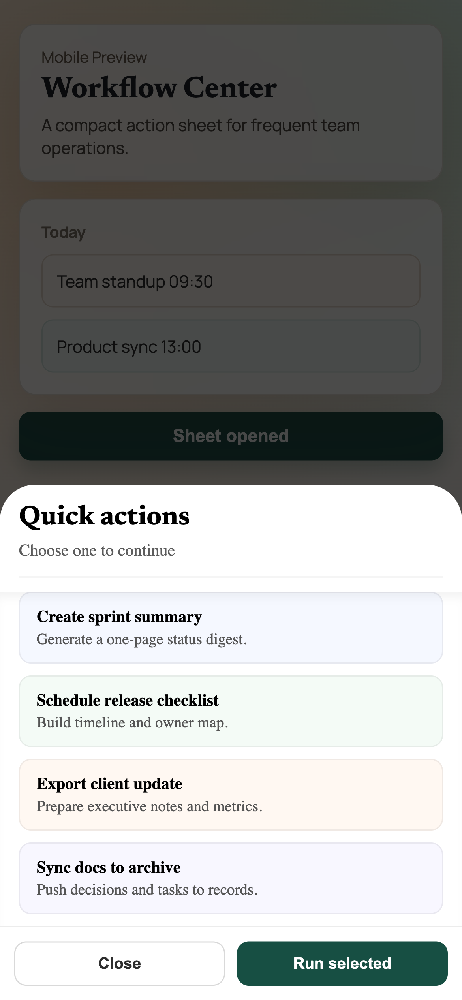
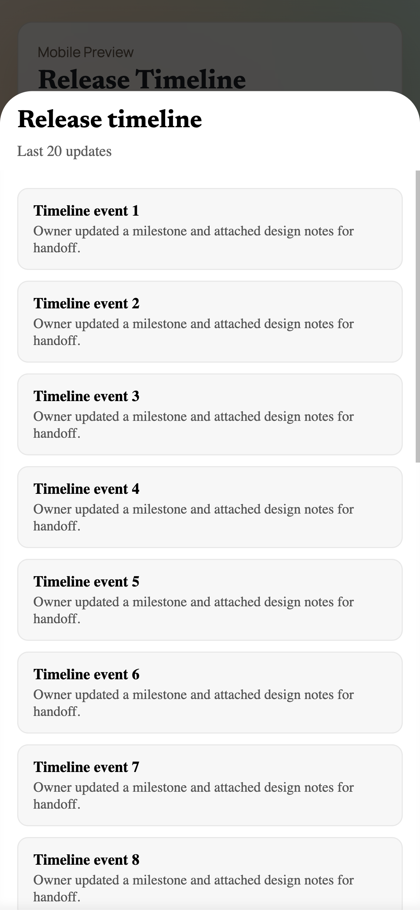
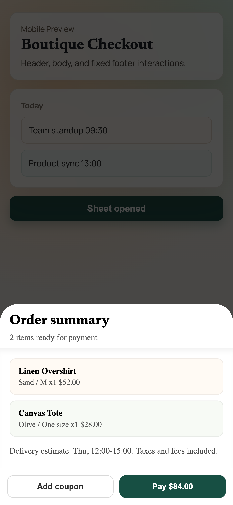
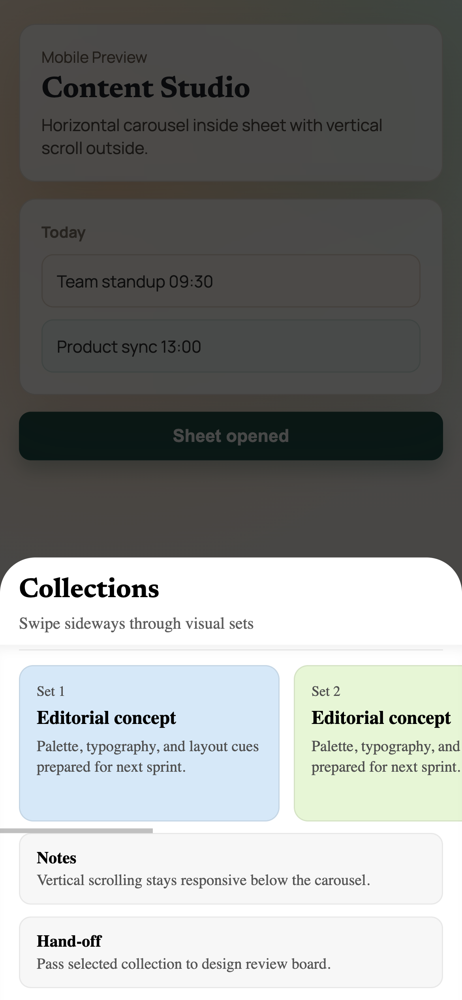
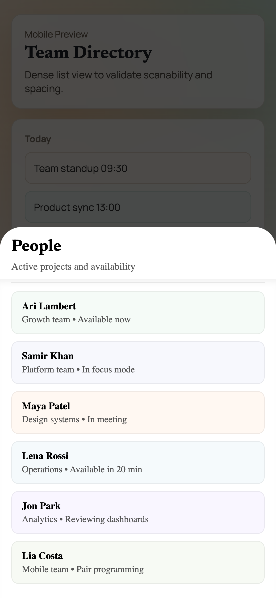
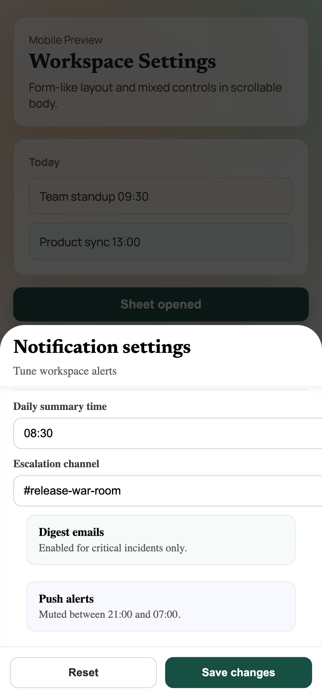

[](https://www.npmjs.com/package/@rakhimgaliyev/react-bottom-sheet)

`@rakhimgaliyev/react-bottom-sheet` is a swipe-to-close bottom sheet for React web apps.

Supports modern mobile browsers (including iOS Safari). This package targets modern JS runtime/browsers (no ES5 build).

## Storybook Preview

Mobile screenshots:

<table>
  <tr>
    <td></td>
    <td></td>
    <td></td>
  </tr>
  <tr>
    <td></td>
    <td></td>
    <td></td>
  </tr>
</table>

## Installation

```bash
npm i @rakhimgaliyev/react-bottom-sheet
```

## Usage

### Recommended API (`onOpenChange`)

```tsx
import { useState } from "react";
import { BottomSheetDialog } from "@rakhimgaliyev/react-bottom-sheet";

export default function Example() {
  const [open, setOpen] = useState(false);

  return (
    <>
      <button onClick={() => setOpen(true)}>Open</button>

      <BottomSheetDialog open={open} onOpenChange={setOpen}>
        <div style={{ height: 300 }}>Content here</div>
      </BottomSheetDialog>
    </>
  );
}
```

### Legacy API (`setOpen`)

`setOpen` is still supported for backward compatibility:

```tsx
<BottomSheetDialog open={open} setOpen={setOpen}>
  <div>Content</div>
</BottomSheetDialog>
```

## Props

- `open: boolean` - controls open state.
- `onOpenChange?: (open: boolean) => void` - recommended controlled callback.
- `setOpen?: (open: boolean) => void` - legacy alias.
- `children: ReactNode` - sheet content.
- `header?: ReactNode` - optional header area.
- `footer?: ReactNode` - optional footer area.
- `horizontalScrollElRef?: React.RefObject<HTMLElement | null>` - optional ref to nested horizontal scroller.

## Monorepo

- `packages/react-bottom-sheet` - published library package.
- `apps/storybook` - local playground/docs.

## Development

```bash
bun install
bun run typecheck
bun run build
bun run storybook
```

## License

MIT
